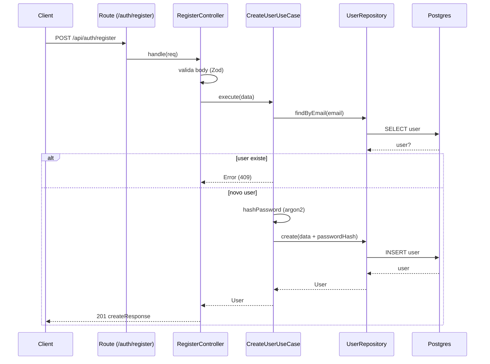

# Arquitetura

O projeto segue uma variação de Clean Architecture, separando regra de negócio, casos de uso, interface HTTP e infraestrutura.

## Mapa de pastas (o que existe hoje)

- `src/main`
  - `app.ts`: instancia o Express, configura middlewares e rotas
  - `server.ts`: sobe o servidor (porta e bootstrap)
  - `instrument.ts`: inicializa Sentry (quando `SENTRY_DSN` estiver configurado)

- `src/interfaces/http`
  - `routes/**`: definição de rotas (prefixadas por `/api` em `app.ts`)
  - `controllers/**`: controllers HTTP
  - `middlewares/**`: middlewares (auth, csrf, error handler)
  - `cookies/**`: opções do cookie de autenticação
  - `factories/**`: wiring/DI simples (ex: factories de controllers e `makeTokenService`)

- `src/usecases`
  - casos de uso (ex: `CreateUserUseCase`, `LoginUseCase`)

- `src/domain`
  - entidades (ex: `User`)
  - contratos (ex: `IUserRepository`)
  - serviços (ex: `ITokenService`)

- `src/infrastructure`
  - implementações de contratos (ex: Prisma repository)
  - integrações com libs (ex: JWT)

- `src/utils`
  - helpers compartilhados (ex: `createResponse`, hashing de senha)

## Regras de dependência

Regras práticas (para manter o acoplamento baixo):

- `domain` não importa nada do resto do projeto
- `usecases` pode importar `domain` e `utils`
- `interfaces` pode importar `usecases`, `domain` (DTOs) e `utils`
- `infrastructure` implementa contratos do `domain` e pode importar libs externas
- `main` só faz composição e bootstrap

## Fluxo de request (exemplo: cadastro)

Rota atual: `POST /api/auth/register`

Fluxo:

1. `src/main/app.ts` registra `app.use('/api', routes)`
2. `src/interfaces/http/routes/index.ts` agrega os routers (ex: `auth.routes.ts`, `health.routes.ts`)
3. `auth.routes.ts` chama `RegisterController.handle`
4. `RegisterController` valida o body (Zod) e chama `CreateUserUseCase.execute(parsed.data)`
5. `CreateUserUseCase`
   - normaliza email
   - valida se já existe (`userRepository.findByEmail`)
   - gera hash com Argon2 (`hashPassword`)
   - persiste via repositório (`userRepository.create`)
6. Controller monta a resposta usando `createResponse`
7. Exceções sobem para `errorMiddleware`

Diagrama (Mermaid):

## Autenticação (visão rápida)

- `POST /auth/login` seta cookie `token`
- `POST /auth/token` retorna `{ token }` (mais indicado para mobile/CLI)
- `auth-middleware.ts` usa o token do Bearer (quando presente) e, se não existir, usa o cookie
- o token é verificado por `JwtTokenService` (`jsonwebtoken`)
- em caso de sucesso, popula `req.user` (hoje contém `{ id, role }`)

## CSRF (visão rápida)

- `CSRF_ENABLED=true` ativa o middleware de CSRF
- o middleware só exige CSRF em métodos unsafe e quando a request depende de cookie
- o endpoint `POST /auth/login` é tratado como rota de cookie auth, então, com CSRF ligado, ele exige `x-csrf-token`
- `GET /auth/csrf` garante o cookie de CSRF e, quando habilitado, retorna `{ csrfToken }`

## Onde fica o wiring (DI simples)

O projeto usa factories simples ao invés de um container central em `src/main`.

Exemplos:

- `src/interfaces/http/factories/jwt/container.ts`: `makeTokenService()`
- `src/interfaces/http/factories/controllers/**`: factories de controllers e middlewares

## Como adicionar uma nova feature (slice)

Existe um guia passo a passo em `docs/NEW_FEATURE.md`.

Checklist resumido:

1. Domain
   - criar/ajustar entidade, DTOs e contratos em `src/domain`
2. Use case
   - implementar em `src/usecases/<feature>`
3. Infra
   - implementar repositório/adapter em `src/infrastructure`
4. HTTP
   - criar controller em `src/interfaces/http/controllers`
   - criar factory se necessário
   - registrar rota em `src/interfaces/http/routes/*.routes.ts`
5. Testes
   - cobrir use case em `tests/usecases`
6. Docs
   - atualizar `docs/API.md` e, se necessário, `docs/openapi/*`
